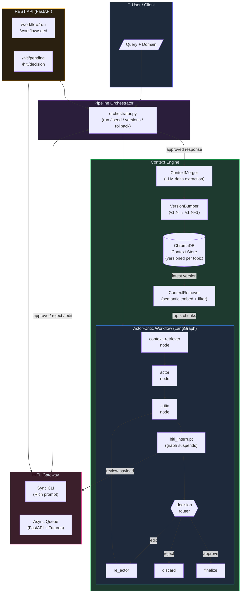
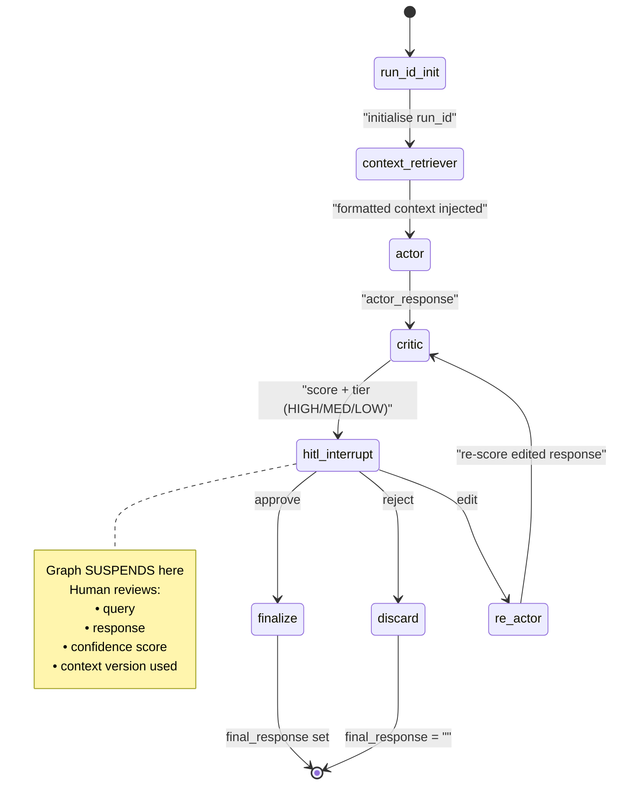
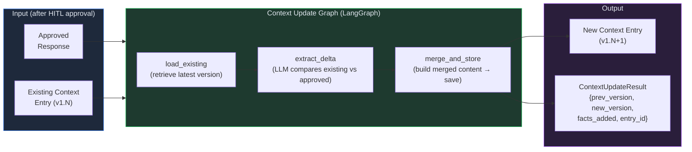
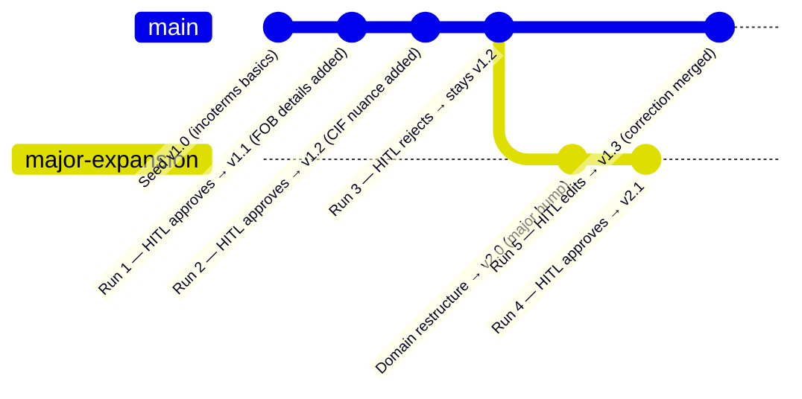
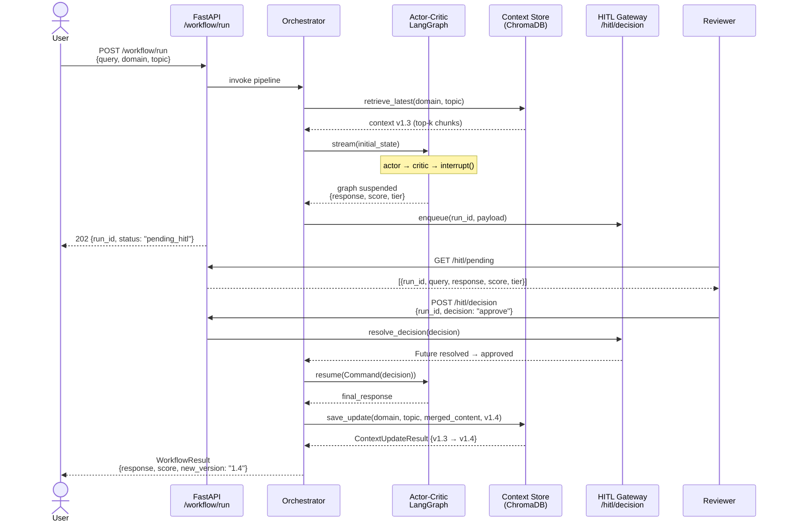
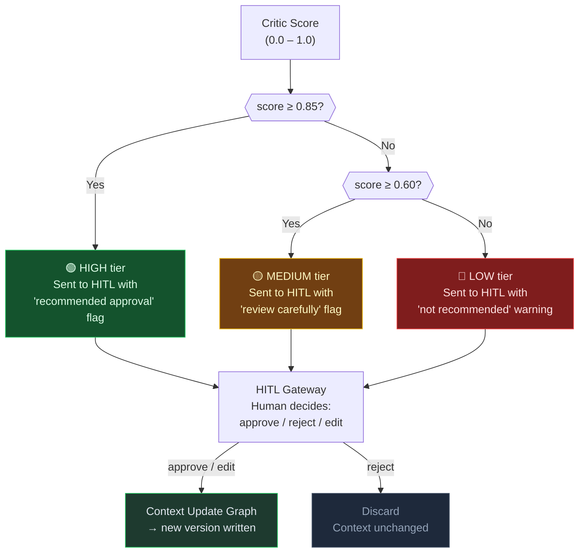

# contextengg — Agentic AI with Incremental Domain Context & HITL

A production-oriented Actor-Critic agentic system where domain knowledge grows incrementally through human-approved interactions. Ships with a **Global Trade** seed dataset covering 8 specialist topics (Incoterms 2020, trade finance, HS codes, trade agreements, logistics, sanctions, documentation, and risk management) — each with a dedicated actor persona, task list, and structured knowledge block.

---

## Diagram 1 — High-Level System Architecture



---

## Diagram 2 — Actor-Critic LangGraph (Node-level)



---

## Diagram 3 — Incremental Context Update Pipeline



---

## Diagram 4 — Context Versioning Lifecycle



---

## Diagram 5 — End-to-End Sequence (Async HITL / REST mode)



---

## Diagram 6 — HITL Confidence Routing



---

## Diagram 7 — Complete End-to-End Data Flow

> Traces every data object (with field names) from the initial user query through all system layers to the final `WorkflowResult` and persisted context version.

```mermaid
flowchart TD
    %% ══════════════════════════════════════════════
    %% ENTRY POINTS
    %% ══════════════════════════════════════════════
    CLI_IN["🖥️ CLI / REST API\n─────────────────\nquery: str\ndomain: str\ntopic_label: str\nreviewer_id: str"]

    %% ══════════════════════════════════════════════
    %% ORCHESTRATOR INIT
    %% ══════════════════════════════════════════════
    ORCH_INIT["Orchestrator — init WorkflowState\n─────────────────────────────────\nrun_id: uuid4()\nquery, domain, topic_label\nretrieved_context: []\ncontext_version: None\nformatted_context: ''\nactor_response: ''\ncritic_score: 0.0\nconfidence_tier: LOW\nhitl_status: pending\nfinal_response: ''"]

    %% ══════════════════════════════════════════════
    %% PHASE 1 — ACTOR-CRITIC LANGGRAPH
    %% ══════════════════════════════════════════════
    CTX_RET["context_retriever node\n────────────────────────\nChromaDB embed query\nfilter: domain + topic_label\ntop-k semantic search\n→ retrieved_context: list[ContextEntry]\n→ context_version: '1.N'\n→ formatted_context: markdown str"]

    CHROMA[("ChromaDB\nContext Store\n─────────────\nContextEntry:\n• entry_id\n• domain\n• topic_label\n• version\n• content\n• approved_by\n• confidence")]

    ACTOR["actor node\n────────────────────────\nSystemMessage:\n  _BASE_SYSTEM + formatted_context\nHumanMessage:\n  query\n→ LLM.invoke(messages)\n→ actor_response: str"]

    CRITIC["critic node\n────────────────────────\nSystemMessage: _CRITIC_SYSTEM\nHumanMessage:\n  QUERY + CONTEXT + ACTOR_RESPONSE\n→ LLM.invoke(messages)\n→ CriticOutput JSON:\n  • confidence: float\n  • reasoning: str\n  • confidence_tier: HIGH|MED|LOW\n→ critic_score, critic_reasoning\n→ confidence_tier (config thresholds:\n   HIGH ≥ 0.85 / MED ≥ 0.60)"]

    INTERRUPT["hitl_interrupt node\n────────────────────────\nLangGraph interrupt()\nGraph SUSPENDS — state snapshot:\n  • run_id\n  • query\n  • actor_response\n  • critic_score\n  • critic_reasoning\n  • confidence_tier\n  • context_version"]

    %% ══════════════════════════════════════════════
    %% PHASE 2 — HITL GATEWAY
    %% ══════════════════════════════════════════════
    HITL_SYNC["HITL Gateway — Sync CLI\n────────────────────────\nRich Panel → reviewer sees:\n  query / response / score / tier\n  context version used\nreviewer inputs:\n  decision: approve|reject|edit\n  edited_response (opt)\n  comment (opt)\n  reviewer_id\n→ HITLDecision"]

    HITL_ASYNC["HITL Gateway — Async REST\n────────────────────────\nenqueue(run_id, payload)\n→ HITLQueueEntry in _queue{}\n→ asyncio.Future created\nAPI: GET /hitl/pending → list\nAPI: POST /hitl/decision\n→ resolve_decision(HITLDecision)\n→ Future.set_result()\n→ Orchestrator unblocks"]

    DECISION{{Decision?}}

    %% ══════════════════════════════════════════════
    %% PHASE 3 — GRAPH RESUME
    %% ══════════════════════════════════════════════
    RESUME["Orchestrator — resume graph\n────────────────────────\nCommand(resume={\n  decision,\n  edited_response,\n  comment,\n  reviewer_id\n})\nac_graph.stream(resume_command)"]

    FINALIZE["finalize node\n────────────────────────\nhitl_status: approved|edited\nreviewed_by: reviewer_id\nfinal_response:\n  = edited_response OR actor_response"]

    DISCARD["discard node\n────────────────────────\nhitl_status: rejected\nfinal_response: ''"]

    RE_ACTOR["re_actor node\n────────────────────────\nReplaces actor_response\nwith human_edited_response\n→ flows back to critic"]

    %% ══════════════════════════════════════════════
    %% PHASE 4 — CONTEXT UPDATE LANGGRAPH
    %% ══════════════════════════════════════════════
    CTX_GRAPH["Context Update Graph (LangGraph)\n────────────────────────────────"]

    LE["load_existing node\n────────────────\nstore.retrieve_latest(\n  domain, topic_label)\n→ existing_entry: ContextEntry|None"]

    ED["extract_delta node\n────────────────\nmerger.extract_delta(\n  existing_entry,\n  approved_response,\n  query, domain,\n  topic_label,\n  approved_by,\n  confidence)\n→ ContextDelta:\n  • extracted_facts: list[str]\n  • merged_summary: str"]

    MS["merge_and_store node\n────────────────\nmerger.build_merged_content(\n  existing_entry, delta)\n→ merged_content: str\nstore.save_update(\n  domain, topic_label,\n  new_content,\n  approved_by,\n  confidence,\n  bump='minor')\n→ new ContextEntry (v1.N+1)\n→ ContextUpdateResult:\n  • previous_version\n  • new_version\n  • facts_added\n  • entry_id"]

    %% ══════════════════════════════════════════════
    %% FINAL OUTPUT
    %% ══════════════════════════════════════════════
    RESULT["WorkflowResult\n────────────────────────\nrun_id: str\nquery: str\ndomain: str\ntopic_label: str\nactor_response: final_response\ncritic_score: float\ncritic_reasoning: str\nconfidence_tier: HIGH|MED|LOW\ncontext_version_used: str|None\n[new_context_version: str|None]"]

    %% ══════════════════════════════════════════════
    %% EDGES
    %% ══════════════════════════════════════════════
    CLI_IN          --> ORCH_INIT
    ORCH_INIT       --> CTX_RET
    CHROMA          -->|"top-k ContextEntry chunks"| CTX_RET
    CTX_RET         -->|"formatted_context + version"| ACTOR
    ACTOR           -->|"actor_response"| CRITIC
    CRITIC          -->|"critic_score + tier"| INTERRUPT

    INTERRUPT       -->|"sync mode"| HITL_SYNC
    INTERRUPT       -->|"async mode"| HITL_ASYNC
    HITL_SYNC       --> DECISION
    HITL_ASYNC      --> DECISION

    DECISION        -->|"approve"| RESUME
    DECISION        -->|"reject"| RESUME
    DECISION        -->|"edit"| RESUME

    RESUME          -->|"approve → hitl_status=approved"| FINALIZE
    RESUME          -->|"reject → hitl_status=rejected"| DISCARD
    RESUME          -->|"edit → swap response"| RE_ACTOR
    RE_ACTOR        -->|"re-score"| CRITIC

    FINALIZE        -->|"final_response"| CTX_GRAPH
    DISCARD         -->|"no context update"| RESULT

    CTX_GRAPH       --> LE
    LE              -->|"existing_entry"| ED
    ED              -->|"ContextDelta"| MS
    MS              -->|"new ContextEntry"| CHROMA
    MS              -->|"ContextUpdateResult"| RESULT
    FINALIZE        --> RESULT

    %% ══════════════════════════════════════════════
    %% STYLES
    %% ══════════════════════════════════════════════
    style CLI_IN      fill:#1e2a3b,color:#e2e8f0,stroke:#6366f1
    style ORCH_INIT   fill:#2a1e3b,color:#e2e8f0,stroke:#a855f7
    style CTX_RET     fill:#1e3a2f,color:#e2e8f0,stroke:#22c55e
    style CHROMA      fill:#0f2027,color:#e2e8f0,stroke:#22c55e
    style ACTOR       fill:#1e293b,color:#e2e8f0,stroke:#3b82f6
    style CRITIC      fill:#1e293b,color:#e2e8f0,stroke:#60a5fa
    style INTERRUPT   fill:#3b1f2b,color:#e2e8f0,stroke:#ec4899
    style HITL_SYNC   fill:#3b1f2b,color:#e2e8f0,stroke:#f472b6
    style HITL_ASYNC  fill:#3b1f2b,color:#e2e8f0,stroke:#f472b6
    style DECISION    fill:#292524,color:#e2e8f0,stroke:#f59e0b
    style RESUME      fill:#2a1e3b,color:#e2e8f0,stroke:#a855f7
    style FINALIZE    fill:#14532d,color:#dcfce7,stroke:#22c55e
    style DISCARD     fill:#1e293b,color:#94a3b8,stroke:#475569
    style RE_ACTOR    fill:#1e293b,color:#e2e8f0,stroke:#3b82f6
    style CTX_GRAPH   fill:#1e3a2f,color:#e2e8f0,stroke:#22c55e
    style LE          fill:#1e3a2f,color:#e2e8f0,stroke:#22c55e
    style ED          fill:#1e3a2f,color:#e2e8f0,stroke:#22c55e
    style MS          fill:#1e3a2f,color:#e2e8f0,stroke:#22c55e
    style RESULT      fill:#2a1f10,color:#fef3c7,stroke:#f59e0b
```



### Data Flow Summary

| Phase | Entry Data | Exit Data |
|---|---|---|
| **1 — Context Retrieval** | `query + domain + topic_label` | `retrieved_context[]`, `context_version`, `formatted_context` |
| **2 — Actor Generation** | `formatted_context + query` | `actor_response: str` |
| **3 — Critic Scoring** | `query + context + actor_response` | `critic_score`, `critic_reasoning`, `confidence_tier` |
| **4 — Graph Suspend** | state snapshot | `HITLPayload` queued / displayed |
| **5 — HITL Decision** | reviewer input | `HITLDecision {decision, edited_response, comment, reviewer_id}` |
| **6 — Graph Resume** | `Command(resume=decision)` | `final_response`, `hitl_status` |
| **7 — Context Delta** | `approved_response + existing ContextEntry` | `ContextDelta {extracted_facts[]}` |
| **8 — Context Merge** | `ContextDelta + merged_content` | new `ContextEntry v1.N+1` → ChromaDB |
| **9 — Final Output** | all state fields | `WorkflowResult {run_id, response, score, tier, new_version}` |

---

## Quick Start

```bash
# 1. Setup
cp .env.example .env        # configure LLM, embedding provider
uv venv .venv
uv pip install -e ".[dev]"
ollama pull llama3.1        # if using Ollama
ollama pull nomic-embed-text

# 2a. Seed initial domain context (basic incoterms demo)
python examples/seed_context.py

# 2b. Seed full Global Trade domain (8 topics — recommended)
python examples/seed_global_trade.py

# 3. Run full pipeline (sync CLI HITL)
python examples/run_sync_hitl.py

# Or via CLI
contextengg run "What Incoterm should I use for containerised cargo?" \
  --domain global_trade --topic incoterms
```

## CLI Commands

| Command | Description |
|---|---|
| `contextengg run "<query>"` | Run full Actor-Critic + HITL + context update |
| `contextengg seed <domain> <topic> --file <path>` | Seed domain context from a text file |
| `contextengg versions <domain> <topic>` | List stored versions for a topic |
| `contextengg rollback <domain> <topic> <version>` | View a prior context version |

## REST API (Async HITL mode)

```bash
python -m api.main   # or: uvicorn api.main:app --reload
```

| Endpoint | Method | Description |
|---|---|---|
| `/workflow/run` | POST | Submit a query (returns `run_id`) |
| `/workflow/seed` | POST | Seed domain context |
| `/hitl/pending` | GET | List pending human reviews |
| `/hitl/decision` | POST | Submit approve / reject / edit decision |
| `/context/metrics` | GET | Context store summary + per-topic metrics |
| `/topics` | GET | List seeded topics for a domain |
| `/health` | GET | Health check |

---

## Web UI (Agentic Context Dashboard)

The dashboard is a single-file HTML application (`ui/index.html`) — **no build step required**.
It communicates with the FastAPI backend over `http://localhost:8000`.

### Prerequisites

| Requirement | Detail |
|---|---|
| FastAPI backend running | `uvicorn api.main:app --reload` on port `8000` |
| Domain context seeded | Run `python examples/seed_global_trade.py` first |
| Browser CORS | Backend enables CORS by default for `localhost` origins |

### Starting the UI

**Step 1 — activate the venv and start the API backend:**

```bash
# Windows (PowerShell)
.venv\Scripts\activate
python -m api.main

# macOS / Linux
source .venv/bin/activate
python -m api.main
```

Expected output:

```
INFO:     Uvicorn running on http://0.0.0.0:8000 (Press CTRL+C to quit)
INFO:     Application startup complete.
```

**Step 2 — open the dashboard:**

Open `ui/index.html` directly in your browser — double-click it in Explorer / Finder, or use:

```bash
# Windows
start ui\index.html

# macOS
open ui/index.html

# Linux
xdg-open ui/index.html
```

Alternatively, serve it with any static file server to avoid browser file-restriction quirks:

```bash
# Python one-liner (port 3000)
python -m http.server 3000 --directory ui
# then open http://localhost:3000
```

### Dashboard Tabs

| Tab | Description |
|---|---|
| **Run Query** | Submit a query to the Actor-Critic pipeline; output appears in the HITL Queue once the graph suspends |
| **HITL Queue** | Review pending decisions — expand any item to see the actor response, critic score ring, and approve / reject / edit controls |
| **Context Metrics** | Live overview of the domain context store — total topics, version counts, knowledge size (KB), HITL-approved entries, and per-topic cards with version history and task lists |

### Quick Examples

The **Quick Examples** panel on the Run Query tab pre-fills the form with one of 8 domain queries — click any card and hit **Submit Query**.

### Connection Status

The header shows a green dot when the API is reachable (`/health`). If you see **API unreachable**, make sure the backend is running on port `8000` before opening the dashboard.

## Running Tests

```bash
pytest tests/ -v
# 25 passed
```

## Project Structure

```
contextengg/
├── core/                   Config, LLM factory, Logger
├── context_engine/         ChromaDB store, retriever, merger, update graph
├── actor_critic/           Actor + Critic nodes, LangGraph workflow, schemas
├── hitl/                   Sync CLI + async queue gateway, FastAPI router
├── pipeline/               Orchestrator + Typer CLI
├── api/                    FastAPI app + routers
├── ui/
│   └── index.html          Single-file Agentic Context Dashboard (no build step)
├── examples/
│   ├── seed_context.py     Basic incoterms seed (single topic)
│   ├── seed_global_trade.py  Full 8-topic Global Trade seed
│   ├── run_sync_hitl.py    Sync CLI demo
│   └── data/
│       └── global_trade_seed.json   Seed spec (JSON)
└── tests/                  Pytest test suite
```

---

## Global Trade Domain Seed

The file `examples/data/global_trade_seed.json` is a structured seed specification for the
`global_trade` domain. Running `seed_global_trade.py` parses it and writes **8 versioned
topic entries** into ChromaDB — each carrying a role persona, task list, and rich markdown
knowledge block that is injected into the Actor system prompt at query time.

### Seeded Topics

| Topic | `topic_label` | Key Content |
|---|---|---|
| Incoterms 2020 | `incoterms` | All 11 rules, risk transfer points, 2020 changes, FOB/FCA container guidance |
| Trade Finance | `trade_finance` | LC / SBLC / D/P / D/A / Bank Guarantee / Open Account — UCP 600, URC 522, URDG 758 |
| HS Codes | `hs_codes` | WCO taxonomy, 6-digit structure, common chapters, mis-classification risks, advance rulings |
| Trade Agreements | `trade_agreements` | USMCA, RCEP, EU FTAs, AfCFTA — RVC/TCC rules, GSP, MFN |
| Logistics | `logistics` | FCL, LCL, air freight, multimodal, bonded warehousing, demurrage, ATA Carnet, TIR |
| Sanctions | `sanctions` | OFAC SDN, BIS EAR, EU Dual-Use Regulation, catch-all controls, screening checklist |
| Documentation | `documentation` | Commercial invoice, packing list, COO, B/L (negotiable vs straight), AWB, customs entry |
| Risk Management | `risk_management` | Country / counterparty / FX / cargo risk, payment method risk matrix, ICC A/B/C insurance |

### Actor Persona (injected into every system prompt)

> You are a global trade specialist AI with deep expertise in international trade finance,
> customs compliance, supply chain logistics, and cross-border regulatory frameworks.
> You provide accurate, actionable, and regulation-aware responses. Always cite the relevant
> regulation, Incoterm, or trade agreement when making claims about compliance or legal obligations.

### Critic Evaluation Rubric

| Criterion | Weight | Description |
|---|---|---|
| Relevance | 1.0× | Does the response directly address the task? |
| Regulatory Accuracy | 2.0× | Are regulations, Incoterms, and trade rules cited correctly? |
| Jurisdiction Specificity | 1.5× | Are jurisdiction-specific differences noted where they exist? |
| Actionability | 1.5× | Can a trade professional act on this response without further research? |
| Completeness | 1.0× | Are all materially relevant aspects of the task addressed? |

> **Critic persona:** Senior trade compliance reviewer — flags responses that generalise
> across jurisdictions without noting regional differences, and proposes context updates
> only when a fact is verifiable and adds durable value.

### Example Queries Per Topic

```bash
# Incoterms
contextengg run "Should I use FOB or FCA for a containerised shipment from Shanghai to Hamburg?" \
  --domain global_trade --topic incoterms

# Trade Finance
contextengg run "What documents must a beneficiary present under a CIF Letter of Credit?" \
  --domain global_trade --topic trade_finance

# HS Codes
contextengg run "What HS chapter covers industrial robots with integrated vision systems?" \
  --domain global_trade --topic hs_codes

# Trade Agreements
contextengg run "Does a product assembled in Mexico from US and Chinese inputs qualify under USMCA?" \
  --domain global_trade --topic trade_agreements

# Logistics
contextengg run "When does demurrage start accruing and how can it be avoided?" \
  --domain global_trade --topic logistics

# Sanctions
contextengg run "What parties must be screened before issuing a Letter of Credit?" \
  --domain global_trade --topic sanctions

# Documentation
contextengg run "What causes an LC discrepancy on a Bill of Lading?" \
  --domain global_trade --topic documentation

# Risk Management
contextengg run "How should an exporter hedge FX risk on a net-60 open account sale?" \
  --domain global_trade --topic risk_management
```

### Seed Script Behaviour

- **Idempotent** — re-running skips topics that already exist in ChromaDB (`store.seed()` guards against double-seeding)
- **Version-safe** — existing topic versions are preserved; the seed only writes if no prior version exists
- **Source file** — `examples/data/global_trade_seed.json` is the single source of truth; edit it and delete the ChromaDB collection to re-seed from scratch
